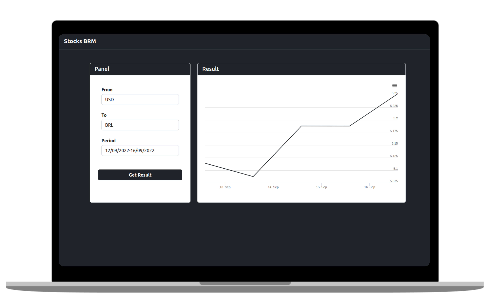
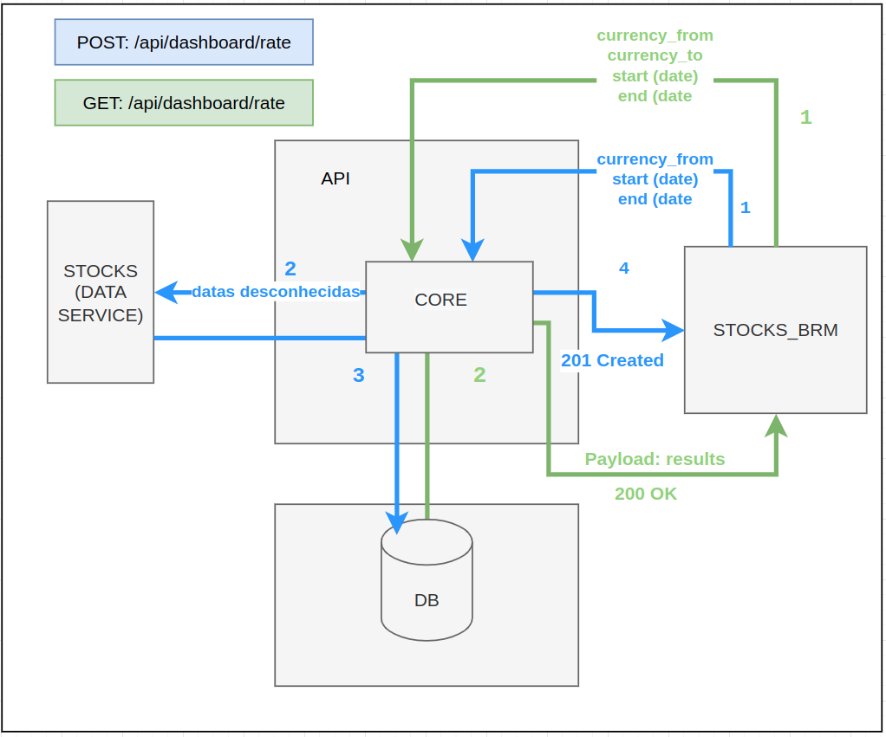

# Stocks BRM

<p align="center">
  
</p>

### Get project
```
git clone https://github.com/cardosorrenan/stocks_brm
cd ./stocks_brm
```

### Show the availables commands
```
make help
```

### Start (up) the containers
```
make start
```

### Required when first time
```
make migrate
```

### Run Tests
```
make test
```

### Open API Docs
```
http://localhost:8000/swagger/
```

### Stocks BRM
```
http://localhost:8005
```

### Application Flow

<p align="center">
  
</p>